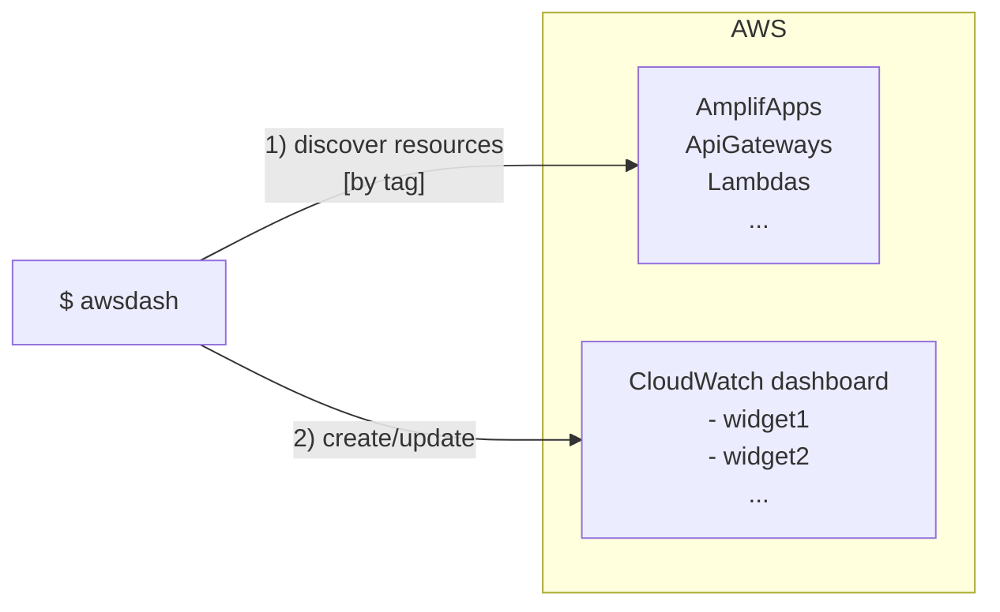

Awsdash is a CLI tool (and library) that creates or updates custom AWS CloudWatch dashboards.


```mermaid
flowchart LR
    cli["$ awsdash"]

    subgraph AWS
        resources["AmplifApps
ApiGateways
Lambdas
..."]
        dashboard["CloudWatch dashboard
- widget1
- widget2
..."]
    end

    cli -->|"1) discover resources
[by tag]"| resources
    cli -->|"2) create/update"| dashboard
```

Tool usage:

```sh
$ go install github.com/go-monk/awsdash@latest
$ awsdash -h
```
